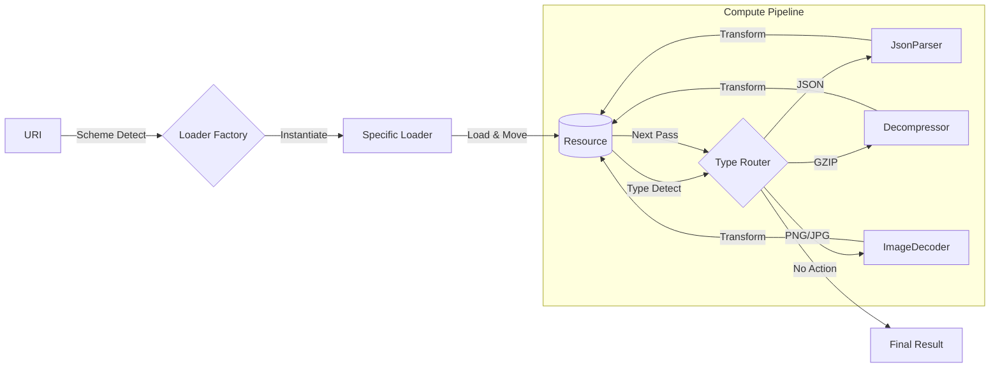

# C++ Resource Processing Pipeline


A modern C++20 pipeline that **ingests URIs, auto-detects content types, and transforms raw data into usable resources**.

It demonstrates a complete processing chain: **Download → Decompress → Decode → Parse**.

> **Note**: This project focuses on **Architecture and Design Patterns**. The core pipeline logic is fully functional, while the specific processing actions (HTTP request, GZIP inflation) are **simulated (mocked)** to demonstrate the flow without external dependencies, following the assignment requirements.

For example, giving it `http://site.com/data.json.gz` will automatically:

1. "Download" the file (`HttpLoader`)
2. "Decompress" it (`Decompressor`)
3. "Parse" the JSON (`JsonParser`)
4. Return the ready-to-use resource

> **Design Goal**: Create a system that is _open for extension but closed for modification_ (SOLID), allowing new resource types and processing strategies to be added via plugins without altering the core pipeline logic.

---

## 🏗 Architecture

The system implements a dynamic state machine where resources flow through a chain of processing units until they reach a stable state.



### Key Technical Decisions

1.  **Zero-Copy & Move Semantics**:

    - Resources and data buffers (`std::vector<uint8_t>`) are passed exclusively via `std::move` and `std::unique_ptr`.
    - This ensures strict **ownership semantics** and eliminates expensive deep copies during pipeline transitions.

2.  **Type Erasure & Polymorphism**:

    - The `ComputePipeline` is agnostic to concrete implementations. It interacts only with `BaseLoader` and `BaseProcessor` abstract interfaces.
    - **Factory Pattern** is used for lazy instantiation of processors only when required by the data type.

3.  **RAII (Resource Acquisition Is Initialization)**:
    - Manual memory management (`new`/`delete`) is strictly forbidden. Lifecycle is managed automatically by smart pointers, preventing memory leaks by design.

---

## ⚡ Quick Start

### Prerequisites

- **Compiler**: GCC 10+, Clang 11+, or MSVC 19.29+ (C++20 support required)
- **Build System**: CMake 3.23 or higher

### Build & Run

The project uses standard CMake workflow.

```bash
# 1. Clone the repository
git clone https://github.com/your-username/cpp-compute-pipeline.git
cd cpp-compute-pipeline

# 2. Configure (Release mode recommended for performance)
cmake -S . -B build -DCMAKE_BUILD_TYPE=Release

# 3. Build
cmake --build build

# 4. Execute
./build/bin/ResourceManagerService
```

### Usage Example

Once running, the service accepts URIs via standard input:

```text
Enter resource URI: http://example.com/data.json.gz

[INFO]: Processing resource with URI: http://example.com/data.json.gz
[INFO]: Adding action: HttpLoader
[INFO]: HttpLoader: Loading resource from http://example.com/data.json.gz
[INFO]: Resource created with type: application/compressed
[INFO]: Adding action: Decompressor
[INFO]: Decompressor: Inflating data (GZIP)...
[INFO]: Adding action: JsonParser
[INFO]: Pipeline processing complete. Final resource type: application/json
```

---

## 🧩 Project Structure

Designed for modularity and separation of concerns:

| Directory          | Description                                                                  |
| :----------------- | :--------------------------------------------------------------------------- |
| `src/pipeline`     | Core logic. Contains the `ComputePipeline` state machine.                    |
| `src/action`       | **Strategy Pattern** implementations. Contains `loaders/` and `processors/`. |
| `src/resource`     | Data container. Holds `Metadata`, content type info, and raw data buffer.    |
| `src/logger`       | Thread-safe logging utility.                                                 |
| `src/contentTypes` | Type definitions and detection logic.                                        |

## 🚀 Extensibility

Adding a new capability (e.g., Video Processing) requires **zero changes** to `ComputePipeline.cpp`:

1.  **Define Type**: Add `video/mp4` to `ContentType`.
2.  **Implement Processor**: Create `VideoDecoder` inheriting from `BaseProcessor`.
3.  **Register**: Add the mapping in `ProcessorFactory`.

The pipeline will automatically route `video/mp4` content to your new processor.

## Future Improvements

Change custom logger to use a more robust logging library like `spdlog`.
